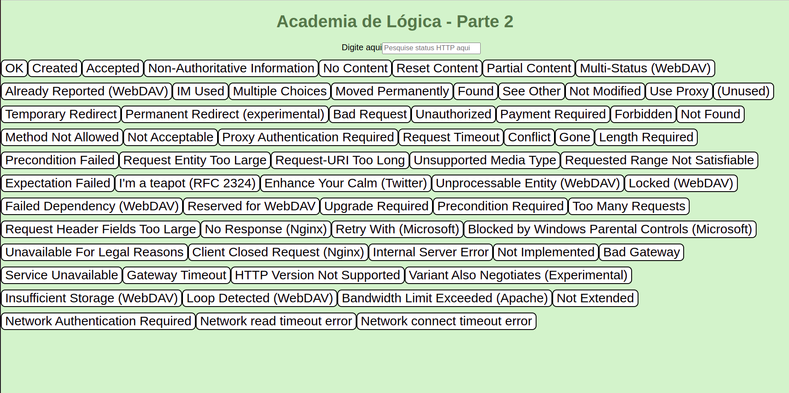

<div align="center"> 
    
</div>

<br>
<br>

## Sobre o projeto:

Esse projeto foi desenvolvido para um live code voltado para aplicação de testes em uma aplicação em React (foto acima). Foi apresentado na academia de lógica criada por mim como embaixadora da turma 16 da Trybe.

A academia de lógica era um projeto semanal que trazia adicionais de conteúdo para a turma e que contou com a colaboração do time de instrução da Trybe e do meu companheiro de embaixa - Leandro Leão.

No live code os participantes do evento tinham que escrever o código do teste que eu solicitava. O ganhador recebeu uma lembrança da Trybe.

---

# Tecnologias usadas:
- [React](https://pt-br.reactjs.org/docs/getting-started.html)
- [React Test Library](https://testing-library.com/docs/react-testing-library/intro/)

#

# Lições desenvolvidas:
 - Primeiro live code;
 - Gerar uma aplicação em React consumindo uma API;
 - Montar todos os testes com respostas;
 - Fazer o deploy em um site de live code;
#

# Instruções

```bash
    # Clonar repositório

    $ git clone git@github.com:CrisSouzaMA/academiadelogica2.git

    # Entrar no diretório

    $ cd src

```

<br>
<br>
<br>
